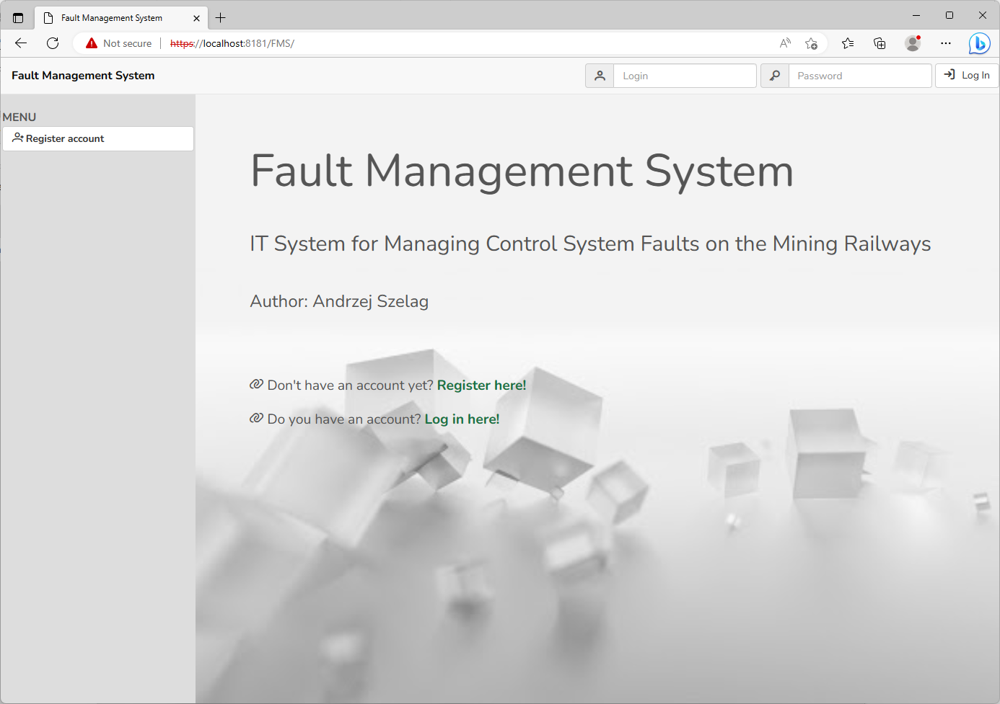
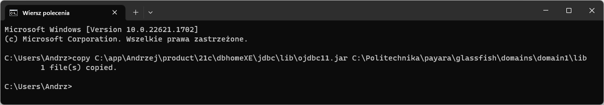
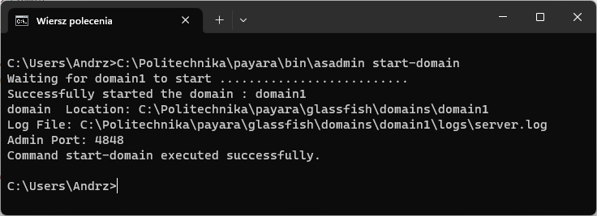
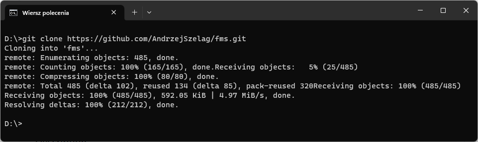
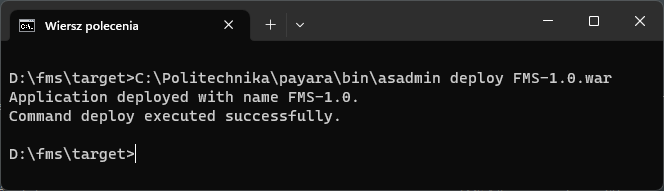
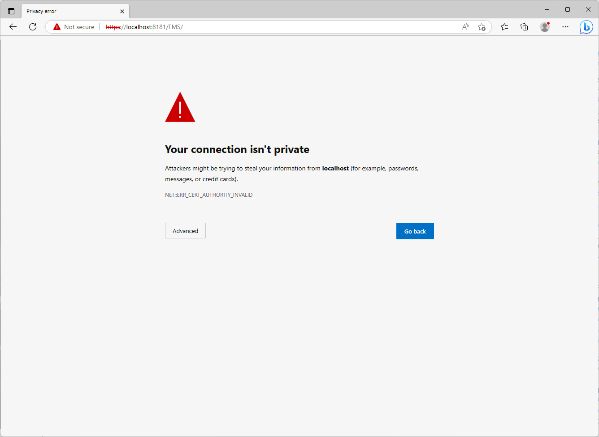

# FMS (Fault Management System)
### IT System for Managing Control System Faults on the Mining Railways

### Tech Stack
* 🔶 Java 17.0.6 LTS
* 🔶 Java Persistence API 2.2
* 🔶 Java Transaction API 1.2
* 🔶 Context and Dependency Injection 2.0
* 🔶 Enterprise JavaBeans 3.2
* 🔶 JavaServer Faces 2.3
* 🔶 Lombok 1.18.26
* 🔶 BootsFaces 1.5.0
* 🔶 PrimeFaces 10.0.0

### Environment
* 🔶 Java EE 8.0.1
* 🔶 Apache Maven 3.8.6
* 🔶 Payara Server 5.2021.10
* 🔶 Oracle Database 21c Express Edition
* 🔶 IntelliJ IDEA 2023.1.1

### Video

🚀 Coming Soon

### Requirements

1. Log into __Windows 11 Pro__ with a user that is a direct member of the Administrators group.
2. Download __Java 17.0.6 LTS__ and install to a local directory (e.g. __C:\Politechnika\jdk-17__).
3. Download __Apache Maven 3.8.6__ and extract zip file to a local directory (e.g. __C:\Politechnika\apache-maven-3.8.6__).
4. Download __Oracle Database 21c Express Edition__, extract zip file to a local directory (e.g. __C:\app\Andrzej\product\21c__) and run __setup.exe__. 

    > #### IMPORTANT
    > 
    > After installation create a new schema, user account and password - you will need this data in __DataSource.java__:
     
       package pl.szelag.config;
    
        import javax.annotation.sql.DataSourceDefinition;
        import javax.ejb.Singleton;
        import java.sql.Connection;
    
        @Singleton
        @DataSourceDefinition(
                name = "java:app/jdbc/FMSDescriptorDS",
                className = "oracle.jdbc.OracleDriver",
                url = "jdbc:oracle:thin:@localhost:1521:XE",
                user = "<USER>",
                password = "<PASSWORD>",
                isolationLevel = Connection.TRANSACTION_READ_COMMITTED)
        public class DataSource {}

6. Download __Payara Server 5.2021.10__ and extract zip file to a local directory  (e.g. __C:\Politechnika\payara__).
7. Copy __ojdbc11.jar__ file from __Oracle Database 21c Express Edition__ to __Payara Server 5.2021.10__.

    > Example
    > 
    > 

7. Verify if __Oracle Database 21c Express Edition__ runs.
8. Start default domain on the __Payara Server 5.2021.10__ using __asadmin__ utility with the __start-domain__ subcommand.

    > Example
    > 
    > 

10. Clone a Github Repository:
    * From Github Repository, click on __Clone__
    * Copy the clone URL (__https://github.com/AndrzejSzelag/fms.git__)
    * In command line Windows, move to partition __D:__ 
    * Use the __git clone__ command along with the copied URL.

    > Example
    > 
    > 
    
11. In command line Windows, move to __D:\fms__ folder, and run the __mvn clean install__ command.
12. In command line Windows, move to __D:\fms\target__ folder and deploy __FMS-1.0.war__ file on __Payara Server 5.2021.10__.

    > Example
    > 
    > 

14. In __Oracle Database 21c Express Edition__ execute __data.sql__ file from __D:\fms\src\main\resources__ folder.
15. In your Web browser, use __https://localhost:8181/FMS__.
16. Click on __Advanced__.

    > Example
    > 
    > 

17. Click on __Continue to local (unsafe)__. 

You should see the main page application (tip: first photo).

### Description

👉 FMS is my first web-based business application in the Java programming language, which summarizes the knowledge I gained in the postgraduate course "Modern business application Java/Jakarta EE" at Lodz University of Technology. This application has cost me a lot of work, although I realize that there is still a lot to improve (e.g. tests).

👉 This application was created with using [__Apache Maven__](https://maven.apache.org/) and [__Java EE__](https://www.oracle.com/java/technologies/java-ee-glance.html) technology with many different standards, such as __JPA__, __JTA__, __EJB__, __CDI__, __JSF__ etc. It also uses the advanced [__Oracle Database XE__](https://www.oracle.com/pl/database/technologies/appdev/xe.html) and [__Payara Server__](https://www.payara.fish/downloads/payara-platform-community-edition/) application server.
